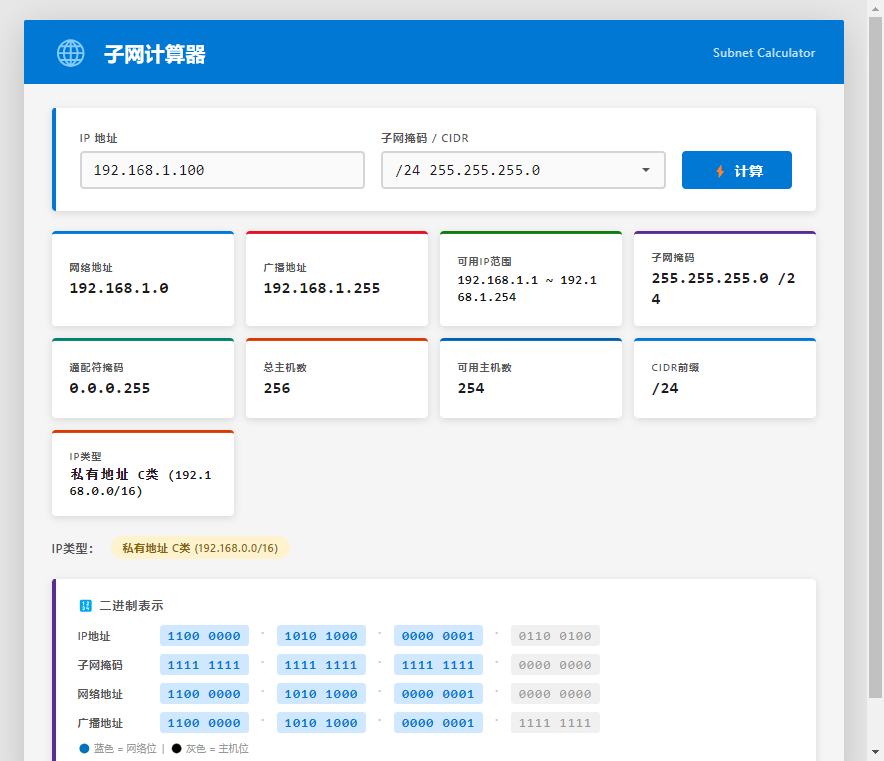

# 子网计算器 · Subnet Calculator

[](https://github.com/liuhua1202/subnet-calculator/releases)
[](LICENSE)
[](https://github.com/liuhua1202/subnet-calculator)
[](https://www.electronjs.org/)

Metro 风格的 Windows 桌面子网计算器，基于 Electron 构建。实时计算网络地址、广播地址、可分配 IP 范围、IP 类型识别、二进制表示。



## ✨ 特性

- 🧮 **完整子网计算**：网络地址、广播地址、可分配 IP 范围、子网掩码、通配符掩码、总/可用主机数
- 📋 **下拉式 CIDR 选择**：33 个选项（`/0` ~ `/32`），倒序排列，旁注点分十进制掩码，所见即所得
- 🔍 **IP 类型自动识别**：A/B/C 类、RFC1918 私有、回环、链路本地、组播、保留地址、文档示例段等
- 💾 **二进制表示**：4 段 8 位并排展示，网络位（蓝色）/主机位（黑色）一眼区分
- ⚡ **即时计算**：IP 输入 400ms 防抖、掩码变更立即重算
- 📦 **单文件便携**：71 MB 独立 `.exe`，零安装，双击即用
- 🔒 **单实例锁**：避免重复启动占用端口

## 📦 下载

前往 [Releases 页面](https://github.com/liuhua1202/subnet-calculator/releases) 下载最新版的 `SubnetCalculator-1.0.0-portable.exe`（约 71 MB）。

> Windows 10/11 64 位。**无需安装任何运行时**，双击即可运行。

## 🚀 本地运行

### 环境要求

- Node.js ≥ 18
- npm ≥ 9
- Windows 10/11（打包目标平台）；其他平台可运行 `npm start` 但打包需 Windows + .NET Framework（用于编译 7za shim）

### 启动开发模式

```bash
git clone https://github.com/liuhua1202/subnet-calculator.git
cd subnet-calculator
npm install
npm start
```

### 打包便携 .exe

```bash
npm run build
# 产物：dist/SubnetCalculator-1.0.0-portable.exe
```

可用的 npm scripts：

| 命令 | 作用 |
|---|---|
| `npm start` | 启动 Electron 开发模式 |
| `npm run build` | 打包 portable 单文件 .exe |
| `npm run build:installer` | 打包 NSIS 安装版（可选） |
| `npm run build:all` | 同时打包 portable + installer |

## 🏗️ 技术栈

- **[Electron 33](https://www.electronjs.org/)** — 跨平台桌面运行时
- **[electron-builder 25](https://www.electron.build/)** — 打包工具，输出 portable 单文件
- **纯 HTML/CSS/JS** — 无前端框架，单文件 `index.html` 自包含
- **GitHub Actions** — CI/CD，`windows-latest` runner 自动构建

### 7za symlink 绕过方案

`electron-builder` 依赖 `winCodeSign` 做 Windows 代码签名，但解压时含 macOS `.dylib` 软链接，Windows 默认权限下 `7za` 失败（exit code 2）。本仓库通过 [`build/7za-wrapper/Program.cs`](build/7za-wrapper/Program.cs) 实现 C# shim：注入 `-snl-` 参数跳过符号链接，然后由 `electron-builder` 的 npm postinstall 把它编译成 `node_modules/7zip-bin/win/x64/7za.exe`，原 `7za.exe` 备份为 `7za-real.exe`。

## 📂 项目结构

```
subnet-calculator/
├── main.js                    # Electron 主进程（单实例锁、菜单、About）
├── index.html                 # 全部 UI + CSS + JS（单文件自包含）
├── package.json               # 依赖与 electron-builder 配置
├── build/
│   └── 7za-wrapper/
│       └── Program.cs         # 7za C# shim 源码
├── docs/
│   └── screenshot.png
├── .github/workflows/
│   └── build.yml              # CI：构建 + 发 Release
├── LICENSE                    # MIT
└── README.md
```

## 🧪 CI/CD

[`.github/workflows/build.yml`](.github/workflows/build.yml) 在以下事件自动构建：

| 事件 | 行为 |
|---|---|
| push 到 `main` | 构建 .exe 并上传为 artifact |
| 推送 tag（`v*`） | 构建 + 自动创建 GitHub Release 并附 .exe |
| Pull Request | 构建验证但不发布 |
| 手动触发 | Actions 页 Run workflow |

发新版：

```bash
# 1. 提交代码
git add -A
git commit -m "feat: 某某功能"
git push origin main

# 2. 打 tag 触发发布
git tag v1.1.0
git push origin v1.1.0
```

## 📝 计算示例

| 输入 | 网络地址 | 广播地址 | 可用范围 | 主机数 |
|---|---|---|---|---|
| `192.168.1.100 /24` | `192.168.1.0` | `192.168.1.255` | `.1 ~ .254` | 254 |
| `172.16.50.99 /20` | `172.16.48.0` | `172.16.63.255` | `.48.1 ~ .63.254` | 4,094 |
| `10.5.5.5 /30` | `10.5.5.4` | `10.5.5.7` | `.5 ~ .6` | 2 |
| `8.8.8.8 /8` | `8.0.0.0` | `15.255.255.255` | `8.0.0.1 ~ 15.255.255.254` | 16,777,214 |

## 🐛 故障排查

**Q: 启动后白屏？**
A: 检查是否有 Windows Defender SmartScreen 拦截。便携 .exe 未签名时常见，可右键 → 属性 → 勾选"解除锁定"。

**Q: `npm install` 时 `7za` 解压失败？**
A: 这是 Windows 上的已知问题。`build/7za-wrapper/` 下的 C# shim 应在 postinstall 阶段自动编译替换。如未生效，手动执行：
```bash
"C:\Program Files (x86)\Microsoft Visual Studio\2022\BuildTools\MSBuild\Current\Bin\Roslyn\csc.exe" \
  -out:node_modules/7zip-bin/win/x64/7za.exe \
  build/7za-wrapper/Program.cs
# 然后把原 7za.exe 重命名为 7za-real.exe
```

**Q: GitHub Actions 失败？**
A: 在 Actions 页查看日志。`windows-latest` runner 自带 csc.exe，理论上可直接编译。若失败，把日志粘到 Issue。

## 📄 许可证

[MIT](LICENSE) © 2026 liuhua1202